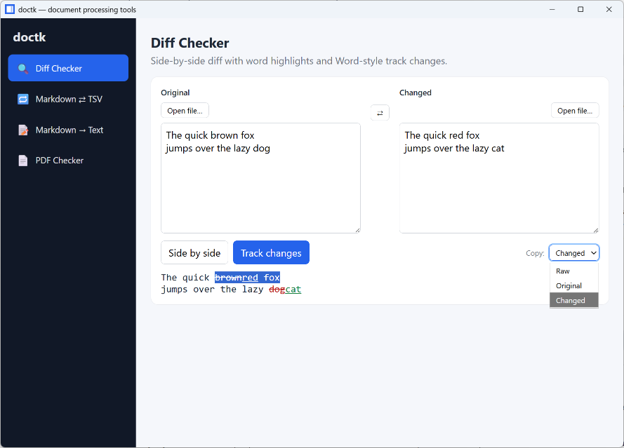
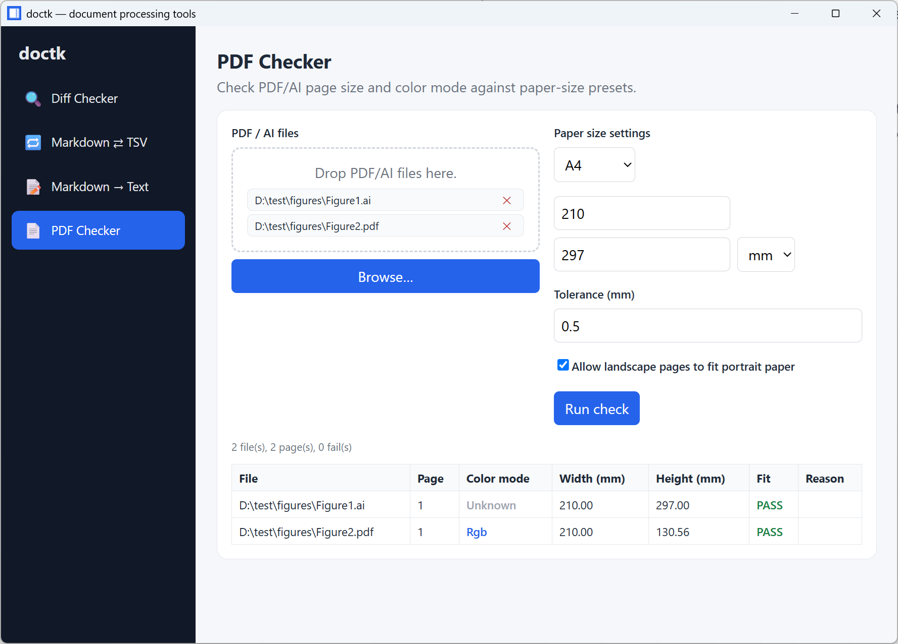

# doctk — Document Processing Tools

A lightweight desktop utility for everyday document-processing tasks.

> [!WARNING]
> This project is vibe coded

## Why doctk?

`doctk` provides a small set of practical document-processing tools for daily use. While many full-featured web alternatives exist, I found myself drowning in browser tabs and popups. I wanted something simple, fast, and distraction-free — so I built it.

## What it does

| Feature | What it does | CLI command |
|---|---|---|
| **Diff Checker** | Side-by-side comparison with word-level highlights, or Microsoft Word-style track changes view. | `doctk diff` |
| **Markdown ⇄ TSV** | Convert markdown tables to/from TSV. | `doctk table md2tsv` / `doctk table tsv2md` |
| **Markdown → Text** | Strip Markdown syntax and export plain text. | `doctk md2text` |
| **PDF Checker** | 	Validate PDF/Illustrator page size and color mode against predefined paper-size presets. | `doctk pdf check` |

## Quick start

> [!NOTE]
> The Windows GUI is fully tested. Linux and macOS GUI and all CLI support is experimental. Please open an issue if you encounter any problems or would like prebuilt binaries for additional platforms.

### GUI

- **Windows 10/11**: Download the prebuilt installer (`.msi` or `.exe`) from the [releases](https://github.com/Han-Cao/doctk/releases) page.
- **Linux / macOS**: Build from source. See the [DEVELOPMENT.md](docs/DEVELOPMENT.md) for system dependencies and build instructions.

### CLI

```bash
# Run tests
cargo test

# Build the CLI (Linux/macOS)
./scripts/build-cli.sh
```

For full prerequisites and build instructions, see
[DEVELOPMENT.md](docs/DEVELOPMENT.md).

## Example usage

### Diff Checker (track changes view)

Compare two texts side-by-side, with options to copy the original, changed, or raw track-changes output.


### PDF Checker

Quickly verify whether your PDF or Illustrator file meets the expected paper size and color format. 

